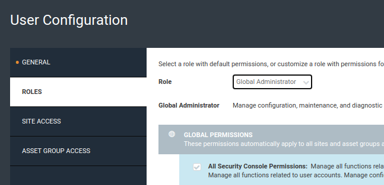

# Development

This integration focuses on
[Rapid7 InsightVM](https://www.rapid7.com/products/insightvm/) and is using
[Rapid7 InsightVM REST API](https://help.rapid7.com/insightvm/en-us/api/index.html)
for interacting with the InsightVM platform.

## Prerequisites

InsightVM is a self-hosted product and it has system requirements that are
listed [here](https://docs.rapid7.com/insightvm/requirements).

The setup process consists of
[downloading InsightVM](https://docs.rapid7.com/insightvm/download) (Windows and
Linux both supported),
[installation process](https://docs.rapid7.com/insightvm/install) and then
[accessing the security console](https://docs.rapid7.com/insightvm/log-in-and-activate).

## Provider account setup

To install a Rapid7 InsightVM account, please use the links from above. During
the installation you'll be asked for admin account username and password that
you'll later use to access the Security Console.

To set up a Rapid7 InsightVM account, please follow these steps:

1. Visit the [Rapid7 Try](https://jfrog.com/artifactory/start-free/) page - it
   is a 2 page/step form where you're first asked details about you and your
   organization and on the form you're able to select InsightVM as the product
   you want to sign up for.
2. Make sure to select InsightVM on the second form page, it might be
   preselected by default, if not just select it manually.
3. After creating the account you should receive an email titled "Your InsightVM
   License Key - Get Started" which will contain your one-time-use License-Key.
   You'll need it for the next step.
4. Go to https://localhost:3780 (the default Security Console access uri), it
   might take some time before everything is initialized and you're able to see
   the login screen.
5. Log in to the console using the admin username and password you choose during
   the installation procedure.
6. After the first time login you'll be asked to do two things:

1) enter the license key from the email that you received
2) connect your account with the insight account using the console pairing key
   <- this step is described very well on
   [this page](https://www.rapid7.com/cx/get-started-with-insightvm-cloud-capabilities/2/).

7. The provider account is now fully set up.

## Authentication

In order to use InsightVM REST API the requests must supply authorization
credentials. This integration does it by including Authorization header using a
Base64 of the InsightVM console account's "username:password".

Note: The admin account that got created during the installation process can be
used for this, but you might want to create a separate user account instead. To
do this, you'll need to navigate to Security Console's
[Administration section](https://localhost:3780/admin/index.jsp). Once there,
you can [create](https://localhost:3780/admin/user/config.jsp) and
[manage](https://localhost:3780/admin/users.jsp) user accounts.

If you want to create a new user, use the
[create](https://localhost:3780/admin/user/config.jsp) and fill out the form.\
**Important note:** if the new user's role isn't "Global Administrator" this won't
work because that account doesn't have sufficient permissions for this integration
to do all of its requests.



1. Create a .env file at the root of this project, and set the
   INSIGHT_CLIENT_USERNAME variable to the admin username that you've set up
   during the development.

```bash
INSIGHT_CLIENT_USERNAME="account username here"
```

2. Set the .env's INSIGHT_CLIENT_PASSWORD variable to the admin password that
   you've set up during the development.

```bash
INSIGHT_CLIENT_USERNAME="account username here"
INSIGHT_CLIENT_PASSWORD="account password here"
```

3. Finally, you also need to set .env's INSIGHT_HOST variable to the URL that
   points the Security Console (by default, the localhost:3780).

```bash
INSIGHT_HOST=localhost:3780
INSIGHT_CLIENT_USERNAME="account username here"
INSIGHT_CLIENT_PASSWORD="account password here"
```

After following the above steps, you should now be able to start contributing to
this integration. The integration will pull in the `INSIGHT_CLIENT_USERNAME`,
`INSIGHT_CLIENT_PASSWORD` and `INSIGHT_HOST` variables from the `.env` file and
use them when making requests.
